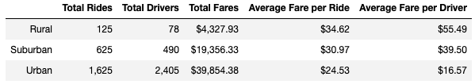

# Module5-Challenge-JB-Trahin
Module 4 challenge on performing an analysis of rideshare data using Python, Pandas, Jupyter Notebook and Matplotlib.

## Project Overview

You’ve been asked by your CEO to create an overall snapshot of the provided ride-sharing data. In addition to your scatter and pie charts, she would like to see a summary table of key metrics of the ride-sharing data by city type, and a multiple-line graph that shows the average fare for each week by each city type.

In this project, our final Python script will need to be able to deliver the following information when ran on top of a provided xls spreadsheets: 

1. A summary table of key metrics of the ride-sharing data by city type
2. A multiple-line graph that shows the average fare for each week by each city type.

## Resources
- Data Source: city_data.csv, ride_data.csv
- Software: Python 3.6.1, Pandas 0.25.1, NumPy 1.17.2, Anaconda 2019.10, Conda 4.7.12, Jupyter Notebook 6.0.1

## Summary
Here is a summary table of key metrics of the ride-sharing data by city type:

We can draw two main insights from this summary:
1. As the number of total rides and total drivers increases, the average fare per ride decreases.
2. As the number of total rides and total fares increases, the average fare per driver decreases.

Here is a multiple-line graph that shows the average fare for each week by each city type:

We can see that the weekly total fare by city type varies greatly between Urban, Suburban and Rural areas. However, the weekly total fare is consistent week over week within a specific city type.

We notice that for the period of analysis (first 18 weeks of January 2019), the weekly total fare ranges were:
	- between $1,500 and $3,000 for Urban areas
	- between $500 and $1,500 for Suburban areas
	- between $0 and $500 for Rural areas